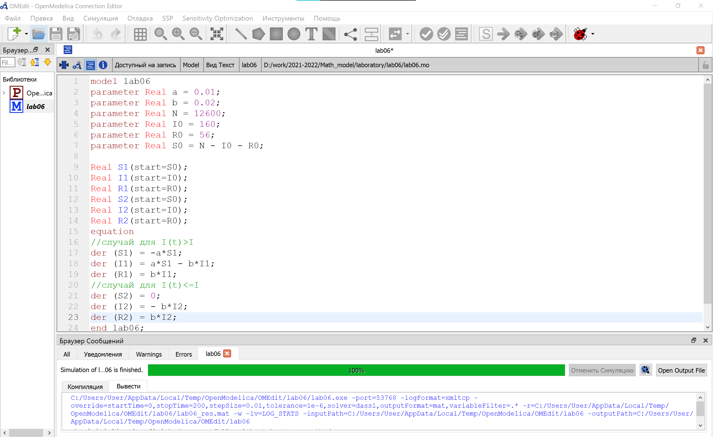
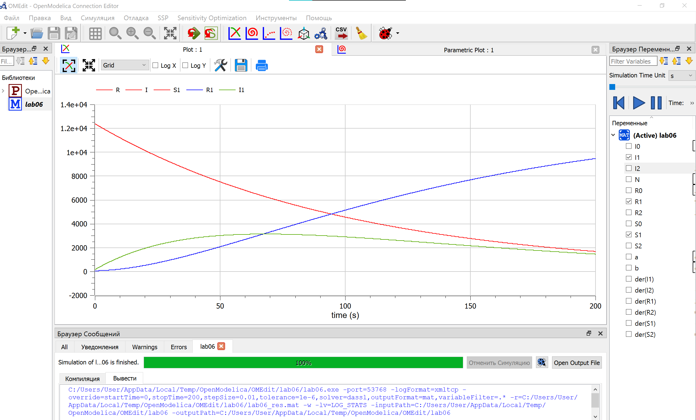
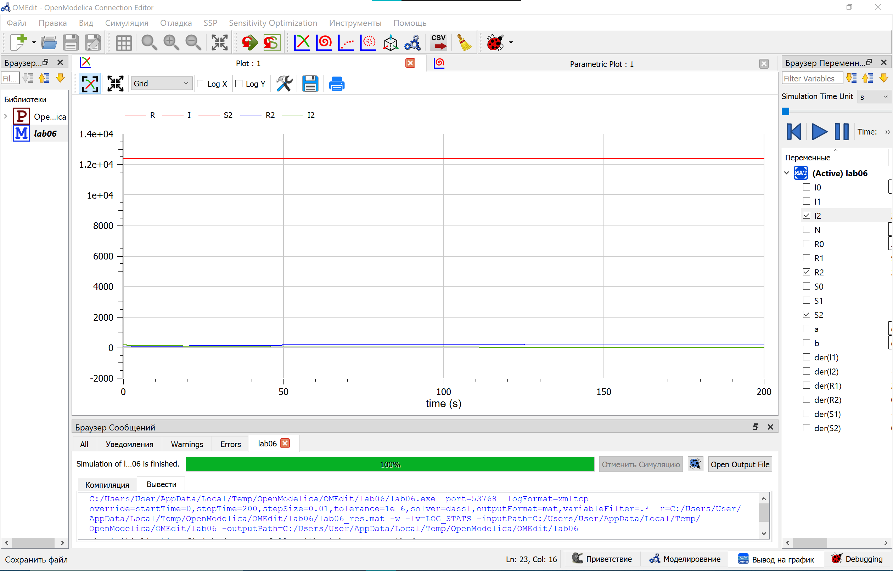
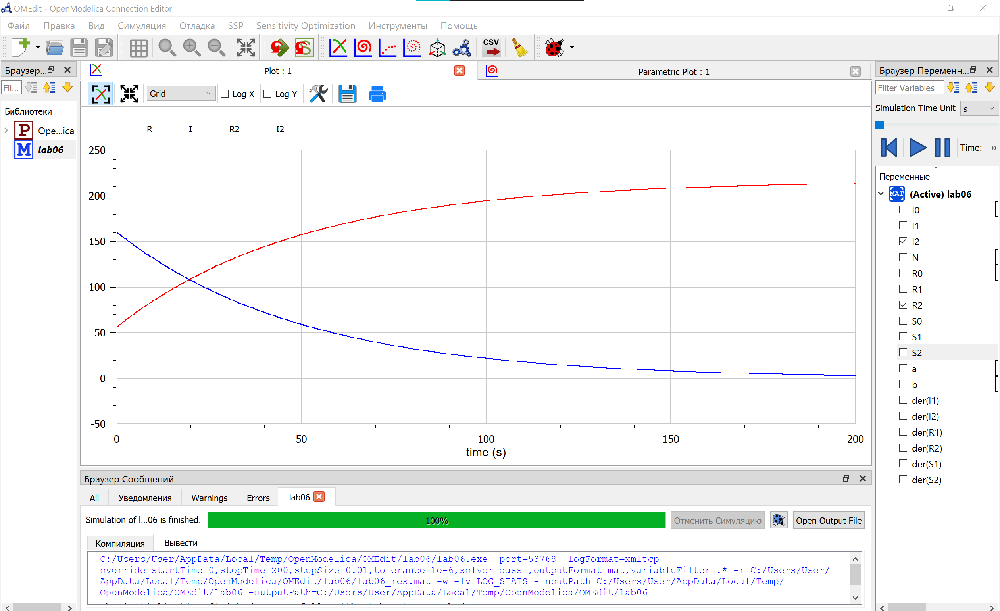
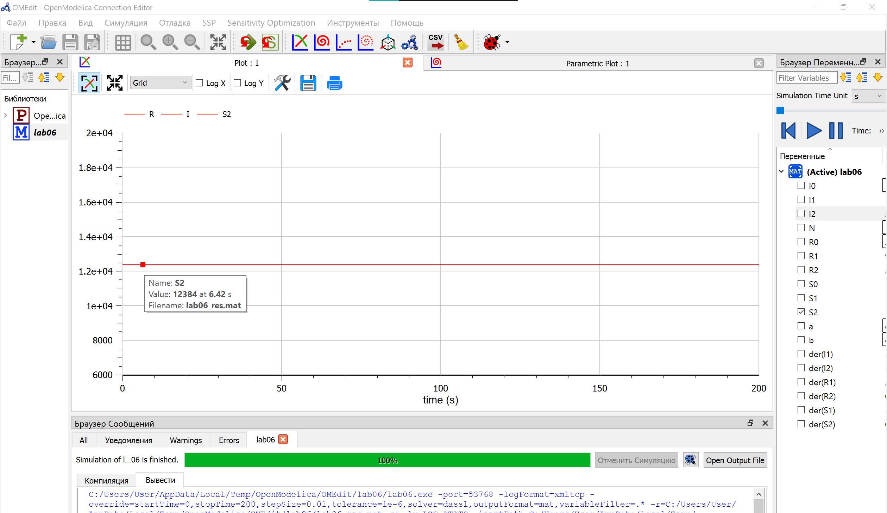

# Цель работы

Построить графики изменения числа особей в каждой из трех групп. Рассмотреть, как будет протекать эпидемия в случае:

- I(t)$\leq$I
- I(t)>$I^*$

# Задание работы

### Вариант 37

На одном острове вспыхнула эпидемия. Известно, что из всех проживающих на острове (N=12 600) в момент начала эпидемии (t=0) число заболевших людей (являющихся распространителями инфекции) I(0)=160, А число здоровых людей с иммунитетом к болезни R(0)=56. Таким образом, число людей восприимчивых к болезни, но пока здоровых, в начальный момент времени S(0)=N-I(0)- R(0).

Постройте графики изменения числа особей в каждой из трех групп. Рассмотреть, как будет протекать эпидемия в случае:

- I(t)$\leq$I
- I(t)>$I^*$

# Теоретическое введение
## Постановка задачи

Рассмотрим простейшую модель эпидемии. Предположим, что некая популяция, состоящая из N особей, (считаем, что популяция изолирована) подразделяется на три группы. Первая группа - это восприимчивые к болезни, но пока здоровые особи, обозначим их через S(t). Вторая группа – это число инфицированных особей, которые также при этом являются распространителями инфекции, обозначим их I(t). А третья группа, обозначающаяся через R(t) – это здоровые особи с иммунитетом к болезни. До того, как число заболевших не превышает критического значения $I^*$, считаем, что все больные изолированы и не заражают здоровых. Когда I(t)>$I^*$ тогда инфицирование способны заражать восприимчивых к болезни особей.

Таким образом, скорость изменения числа S(t) меняется по следующему закону:

$$
\begin{cases}
\frac{dS}{dt}=-\alpha*S, I(t)>I^* \\
0, I(t) \leq I
\end{cases}
$$

Поскольку каждая восприимчивая к болезни особь, которая, в конце концов, заболевает, сама становится инфекционной, то скорость изменения числа инфекционных особей представляет разность за единицу времени между заразившимися и теми, кто уже болеет и лечится, т.е.:

$$
\begin{cases}
\frac{dI}{dt}=\alpha*S-\beta*I, I(t)>I^* \\
-\beta*I,  I(t) \leq I
\end{cases}
$$

А скорость изменения выздоравливающих особей (при этом приобретающие иммунитет к болезни)

$$\frac{dR}{dt}=\beta*I$$

Постоянные пропорциональности $\alpha, \beta$, - это коэффициенты заболеваемости и выздоровления соответственно. Для того, чтобы решения соответствующих уравнений определялось однозначно, необходимо задать начальные условия. Считаем, что на начало эпидемии в момент времени t=0 нет особей с иммунитетом к болезни R(0)=0, а число инфицированных и восприимчивых к болезни особей I(0) и S(0) соответственно. Для анализа картины протекания эпидемии необходимо рассмотреть два случая: I(0)$\leq I^*$ и I(0)>$I^*$.

# Выполнение лабораторной работы

## Код в OpenModelica

Задаем параметры и прописываем функцию, записываем дифференциальные уравнения.(@fig:001)

{#fig:001 width=100%}

Получаем график SIR для случая I(t)>$I^*$. (@fig:002)

{#fig:002 width=100%}

И график SIR для случая I$\leq I^*$. (@fig:003)

{#fig:003 width=100%}

Т.к. график плохо читается, разбиваем на IR(@fig:004) и S(@fig:005).

{#fig:004 width=100%}

{#fig:005 width=100%}

# Вывод

В ходе выполнения лабораторной работы:

Построили графики изменения числа особей в каждой из трех групп. Рассмотрели, как будет протекать эпидемия в случае:

- I(t)$\leq$I
- I(t)>$I^*$

# Список литературы

1. Теоретические материалы курса.
