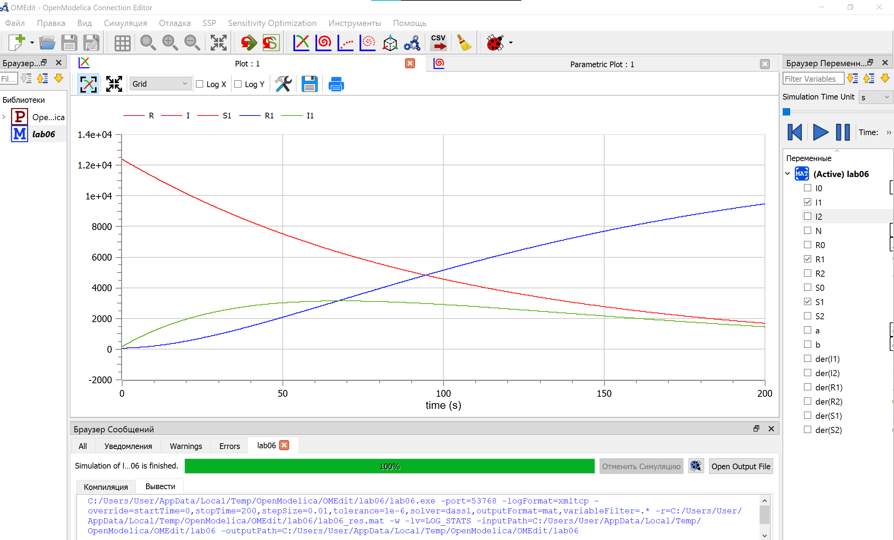
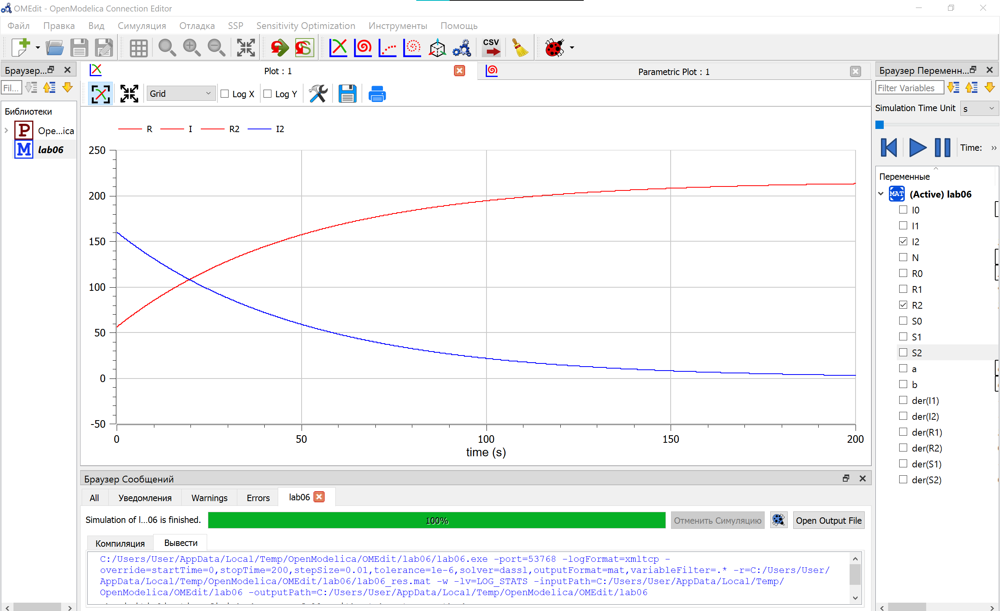

## Цель работы

Построить графики изменения числа особей в каждой из трех групп. Рассмотреть, как будет протекать эпидемия в случае:

- I(t)$\leq$I
- I(t)>$I^\*$

## Задание работы

На одном острове вспыхнула эпидемия. Известно, что из всех проживающих на острове (N=12 600) в момент начала эпидемии (t=0) число заболевших людей (являющихся распространителями инфекции) I(0)=160, А число здоровых людей с иммунитетом к болезни R(0)=56. Таким образом, число людей восприимчивых к болезни, но пока здоровых, в начальный момент времени S(0)=N-I(0)- R(0).

Постройте графики изменения числа особей в каждой из трех групп. Рассмотреть, как будет протекать эпидемия в случае:

- I(t)$\leq$I
- I(t)>$I^\*$

## Теоретическое введение

Первая группа - это восприимчивые к болезни, но пока здоровые особи, обозначим их через S(t). Вторая группа – это число инфицированных особей, которые также при этом являются распространителями инфекции, обозначим их I(t). А третья группа, обозначающаяся через R(t) – это здоровые особи с иммунитетом к болезни.

## Закон скорости изменения числа S(t)

Скорость изменения числа S(t) меняется по следующему закону:

$$
\frac{dS}{dt}=
\begin{cases}
=-\alpha*S, если I(t)>I^\* \\
0, если I(t) \leq I
\end{cases}
$$

## Закон скорости изменения числа I(t)

Скорость изменения числа I(t) меняется по следующему закону:

$$\frac{dI}{dt}=
\begin{cases}
\alpha*S-\beta\*I, если I(t)>I^\* \\
-\beta\*I, если I(t) \leq I
\end{cases}
$$

## Закон скорости изменения числа R(t)

Скорость изменения числа R(t) меняется по следующему закону:

$$\frac{dR}{dt}=\beta*I$$

Постоянные пропорциональности $\alpha, \beta$, - это коэффициенты заболеваемости и выздоровления соответственно.

## График SIR для случая I(t)>$I^\*$

## График IR для случая I$\leq I^*$

## График S для случая I$\leq I^*$

## Результат выполнения работы

В ходе выполнения лабораторной работы:

Построили графики изменения числа особей в каждой из трех групп. Рассмотрели, как будет протекать эпидемия в случае:

- I(t)$\leq$I
- I(t)>$I^\*$

## Список литературы

1. Теоретические материалы курса.
